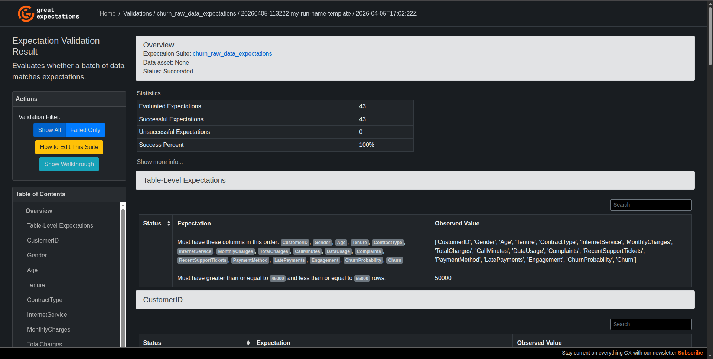

# ChurnGuard AI

> Production-grade customer churn prediction system with full MLOps pipeline

## Problem Statement
Customer churn costs SaaS companies millions annually. ChurnGuard AI predicts which customers are likely to churn 30 days in advance, enabling proactive retention campaigns.

## Business Impact
- **Early detection:** Identify at-risk customers 30 days before churn
- **Cost savings:** Reduce churn rate by 15% (estimated $X saved annually)
- **Efficiency:** Automated pipeline reduces manual analysis time 90%

## System Architecture
[Add diagram later]

## Tech Stack
- **ML Framework:** scikit-learn, XGBoost, LightGBM
- **Experiment Tracking:** MLflow
- **Data Versioning:** DVC
- **Orchestration:** Prefect
- **API:** FastAPI
- **Deployment:** Docker, AWS
- **Monitoring:** Evidently, Prometheus, Grafana

## Data Generation

**Dataset:** `data/raw/telecom_data.csv`
- **Rows:** 50,000 synthetic customer records
- **Churn Rate:** ~65%
- **Generation:** `scripts/generate_synthetic_data.py`

### Version History

**v1.0 (Initial- Buggy)**
- ❌ Negative usage values from unbounded distributions
- ❌ InternetServices nulls ambiguous
- ❌ Inconsistent dtypes

**v2.0 (Current - Production-Ready)**
- ✅ Fixed: Clipped distributions (CallMinutes, DataUsage ≥ 0)
- ✅ Fixed: InternetService "No Service" explicit category
- ✅ Fixed: Enforced dtypes (int64, float64, category)
- ✅ Added: CLI with reproducible seeding
- ✅ Added: Comprehensive data validation

### Regenerating Data
```bash
# Default (50K rows, seed=42)
python scripts/generate_synthetic_data.py

# Custom size
python scripts/generate_synthetic_data.py --rows 100000

# Different seed
python scripts/generate_synthetic_data.py --seed 123
```

## Data Quality

All data undergoes automated validation using Great Expectations:

- ✅ 42 data quality expectations
- ✅ Schema validation (17 columns, correct types)
- ✅ Range validation (no negative usage values)
- ✅ Categorical validation (valid enum values)
- ✅ Statistical validation (churn rate stability)

[View Validation Report](gx/uncommitted/data_docs/local_site/index.html)



## Feature Engineering

**28 features** engineered from 16 raw features, including:

### Engineered Features
- **Tenure Buckets:** Customer lifecycle stages (New → Veteran)
- **Price-to-Service Ratio:** Value perception metric
- **High-Risk Segment:** Multi-factor churn risk flag
- **Contract-Tenure Mismatch:** Exit planning detection
- **Financial Stress Score:** Payment difficulty indicator

### Encoding & Scaling
- One-hot encoding for categorical variables (drop_first=True)
- StandardScaler for numerical features (mean=0, std=1)
- Binary label encoding for target (Churn: Yes=1, No=0)

### Reproducibility
All transformations saved in `models/feature_pipeline.pkl` for production use.

**View details:** [Feature Engineering Plan](docs/feature_engineering_plan.md)

## Project Status
🚧 **In Development** - Phase I: Data Foundation

## Milestones
- [x] Project setup
- [ ] Data pipeline
- [ ] Model development
- [ ] MLOps infrastructure
- [ ] API deployment
- [ ] Production Monitoring

## Quick Start
Coming soon...

## Author
Muhammed Muhasin K
LinkedIn - https://www.linkedin.com/in/muhasin-code

## License
MIT License